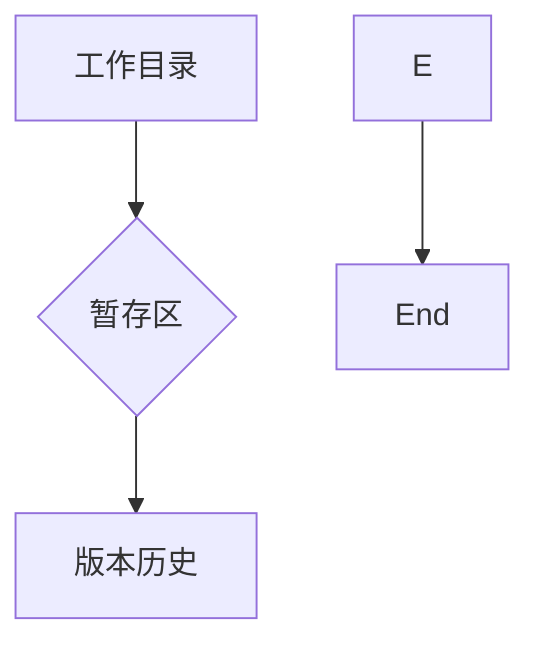

## git operation
```sh
ls -aL # show hidden files
git config --list # show config
# git config 作用域
git config --local user.name "dustin.chen" ## local
git config --system user.name "dustin.chen" ## system 
git config --global user.name "dustin.chen" ## global
git config --list --global
git config --list --system
git config --list --local ## 只能用于某个仓库git
# Initial config
git config --global user.name "dustin.chen"
git config --global user.email "648023262@qq.com"
git config --global color.ui auto
git status
touch index.html
git add .
git status
git commit -m "create learn_git.html"
git status
git log
git restore --staged learn_git.html
git commit -m "add index.html"
git remote add origin git@github.com:DustinCChen/learn_git.git 
git remote -v # show remote repo

# set SSH Key
ssh-keygen -t rsa -C "648023262@qq.com"
cat ~/.ssh/id_rsa.pub # add SSH Key
cat /Users/dustchen/.ssh/id_rsa.pub # add SSH Key
ssh -T git@github.com   # test SSH Key

# push to remote repo
# git clone https://github.com/DustinCChen/dev_nestjs.git 不建议https clone，建议使用SSH clone
git push -u origin main
cd dev_nestjs/
git add .
git commit -m "my first commit"
git push -u origin main
# sync remote repo update to local repo
git remote add origin https://github.com/DustinCChen/dev_nestjs.git
git pull origin main
git status
git checkout -- .
git pull origin main

# 从零开始创建一个项目
git init git_demo
git config --local user.name 'dust.chen'
git config --local user.email 'dust.chen@outlook.com'
git add .
git commit -m "update README.md"
```



