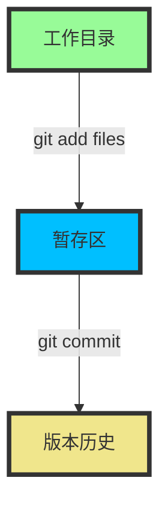
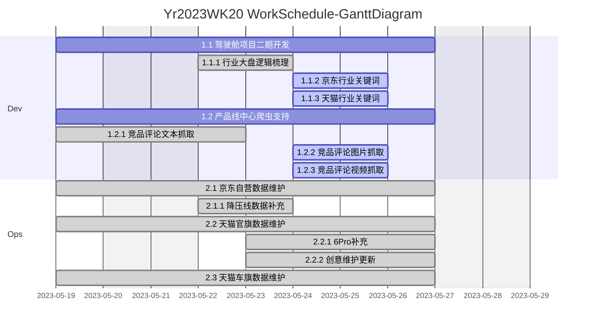

## 什么是Mermaid
*   Mermaid 是一个用于画流程图、状态图、时序图、甘特图的库，使用 JS 进行本地渲染，广泛集成于许多 Markdown 编辑器中。
* 之前用过 PlantUML，但是发现这个东西的实现原理是生成 UML 的图片后上传服务端，每次再从服务端读取，因此觉得不够鲁棒，隐私性也不好，因而弃用。
* Mermaid 作为一个使用 JS 渲染的库，生成的不是一个“图片”，而是一段 HTML 代码，因此安全许多。
* 官网：https://mermaidjs.github.io/
* Github 项目地址：https://github.com/knsv/mermaid
## 如何使用mermaid
* 接下来介绍 Mermaid 的流程图及序列图的语法，也就是大家在工作中常使用的图表。
    *  1.流程图(flowchart)
        ```mermaid
        graph LR;  
        　　A-->B;    
        　　A-->C;  
        　　B-->D;  
        　　C-->D;  
        ```
        *  1.1图表方向
            Mermaid 支持多种图表的方向，语法如下：
            ```
            graph 方向描述
                图表中的其他语句...
            ```
            其中“方向描述”为
            
            用词|含义
            -|-
            TB|从上到下
            BT|从下到上
            RL|从右到左
            LR|从左到右

        * 1.2节点定义
            即流程图中每个文本块，包括开始、结束、处理、判断等。Mermaid 中每个节点都有一个 id，以及节点的文字。
            
            表述|说明
            -|-
            id[文字]|矩形节点
            id(文字)|圆角矩形节点
            id((文字))|圆形节点
            id>文字]|右向旗帜状节点
            id{文字}|菱形节点
            
            需要注意的是，如果节点的文字中包含标点符号，需要时用双引号包裹起来。
            另外如果希望在文字中使用换行，请使用
            替换换行
        * 1.3节点间的连线

            表述|说明
            -|-
            \>|添加尾部箭头
            --|不添加尾部箭头
            --	单线
            --text--|单线上加文字
            ==|粗线
            `==text==`|粗线加文字
            -.-	|虚线
            -.text.-|虚线加文字
            
            ```mermaid
            graph LR;
              A-->B;
            ```
            ```mermaid
            graph LR;
              A---B;
            ```
            ```mermaid
            graph LR
            A -- This is the label text --- B;
            ```
        * 1.4子图表
            使用以下语法添加子图表
            ```
            subgraph 子图表名称
                子图表中的描述语句...
            end
            ```
            对 fontawesome 的支持
            使用 fa: #图表名称# 的语法添加 fontawesome。
            
            ```mermaid
            graph TB
                id1(圆角矩形)--普通线-->id2[矩形]
                subgraph 子图表
                    id2==粗线==>id3{菱形}
                    id3-.虚线.->id4>右向旗帜]
                    id3--无箭头---id5((圆形))
                end
            ```
            ```mermaid
            graph TD
                  B["fa:fa-twitter for peace"]
                  B-->C[fa:fa-ban forbidden]
                  B-->D(fa:fa-spinner);
                  B-->E(A fa:fa-camera-retro perhaps?);
            ``` 
        * 1.5 节点与形状
            默认节点
            ```mermaid
            graph LR
            id1
            ```
            文本节点
            ```mermaid
            graph LR
            id[This is the text in the box];
            ```
            圆角节点
            ```mermaid
            graph LR
            id(This is the text in the box);
            ```
            圆节点
            ```mermaid
            graph LR
            id((This is the text in the circle));
            ```
            非对称节点
            ```mermaid
            graph LR
            id>This is the text in the box]
            ```
            菱形节点
            ```mermaid
            graph LR
            id{This is the text in the box}
            ```
        * 1.6 demo
            ```mermaid
            graph LR
                 id1(Start)-->id2(Stop)
                 style id1 fill:#f9f,stroke:#333,stroke-width:4px;
                 style id2 fill:#ccf,stroke:#f66,stroke-width:2px,stroke-dasharray:5,5;
            ```
            ```mermaid
            graph LR
            classDef default fill:#f90,stroke:#555,stroke-width:4px;
            id1(Start)-->id2(Stop)
            ```
            ```mermaid
            graph TB
                sq[Square shape] --> ci((Circle shape))
             
                subgraph A subgraph
                    di{Diamond with  line break} -.-> ro(Rounded)
                    di==>ro2(Rounded square shape)
                end
             
                e --> od3>Really long text with linebreak<br>in an Odd shape]
             
                cyr[Cyrillic]-->cyr2((Circle shape Начало));
             
                classDef green fill:#9f6,stroke:#333,stroke-width:2px;
                classDef orange fill:#f96,stroke:#333,stroke-width:4px;
                class sq,e green
                class di orange
            ```
            
            ```mermaid
            
            graph TD;
                A-->B;
                A-->C;
                B-->D;
                C-->D;
            
                linkStyle 0 stroke:#0ff,stroke-width:2px;
                linkStyle 1 stroke:#0ff,stroke-width:2px;
                linkStyle 2 stroke:#0ff,stroke-width:2px;
                linkStyle 3 stroke:#ff3,stroke-width:4px;
               classDef node stroke:#0000ff,stroke-width:4px,fill:#70DB93; 
            ```
            
            ```mermaid
            graph LR
                First-->Second;
                Second-->Third;
                Third-->First;
            
                linkStyle 0 stroke:#0ff,stroke-width:2px;
                linkStyle 1 stroke:#0ff,stroke-width:2px;
                linkStyle 2 stroke:#0ff,stroke-width:2px;
                classDef label stroke-width:0;
                classDef node stroke:#0000ff,stroke-width:4px,fill:#70DB93;
            
            ```
            
            ```mermaid
            graph TD;
            id1(A)==>id2(C);
            id3(B)==>id4(D);
            id5(C)==>id4(D);
            style id1 fill:#f9f,stroke:#333,stroke-width:6px;
            style id2 fill:#ccf,stroke:#f66,stroke-width:5px;
            style id3 fill:#f9f,stroke:#333,stroke-width:4px;
            style id4 fill:#ccf,stroke:#f66,stroke-width:3px;
            style id5 fill:#f9f,stroke:#333,stroke-width:2px;
            ```
            
            ```mermaid
            graph LR;
                id1{Start}==>id2(Stop);
                style id1 fill:#f9f,stroke:#333,stroke-width:4px;
                style id2 fill:#ccf,stroke:#f66,stroke-width:2px,stroke:#f33,stroke-dasharray: 10,stroke-width:5px;
            ```
            
            ```mermaid
            graph TB
                id1(圆角矩形)==普通线==>id2[矩形];
                style id1 fill:#f9f,stroke:#333,stroke-width:4px;
                style id2 fill:#ccf,stroke:#f66,stroke-width:2px,stroke:#f33,stroke-dasharray: 10,stroke-width:5px
                id2==粗线==>id3{菱形};
                id3-.虚线.->id4>右向旗帜];
                id3--无箭头---id5((圆形));
                style id3 fill:#808000,stroke:#333,stroke-width:4px;
                style id4 fill:#6A5ACD,stroke:#f66,stroke-width:3px;
                style id5 fill:#00FFFF,stroke:#333,stroke-width:2px;
            ```
            
            ```mermaid
            graph LR
                id1(圆角矩形)--普通线-->id2[矩形]
                subgraph 子图表
                    id2==粗线==>id3{菱形}
                    id3-.虚线.->id4>右向旗帜]
                    id3--无箭头---id5((圆形))
                end
            
            id6["This is the (text) in the box"]
            ```
            
            
            ```mermaid
            
            graph LR
            id1["This is the {text} in the box"]
            
            ```
            
            
            ```flow
              st=>start: Start
              op=>operation: Your Operation
              cond=>condition: Yes or No?
              e=>end
              st->op->cond
              cond(yes)->e
              cond(no)->op
            ```
            
            ```flow
              start=>start: 接收到消息
              info=>operation: 读取信息
              setCache=>operation: 更新缓存
              end=>end: 处理结束
              start->info->setCache->end
            ```
            
            ```mermaid
            graph LR
            KaTex--> A(标记 Accents)
            A-->撇,估计,均值,向量等写于符号上下的标记
            KaTex--> 分隔符_Delimiters
            分隔符_Delimiters-->小中大括号,竖杠,绝对值等分隔符的反斜杠写法
            KaTex--> 公式组_Enviroments
            公式组_Enviroments-->B(.....)
            KaTex-->C(...)
            ```

    * 2.时序图(sequence diagram)
        使用以下语法开始序列图
        ```
        sequenceDiagram
            [参与者1][消息线][参与者2]:消息体
            ...
        ```
        例如
        ```mermaid
        sequenceDiagram
            张三->>李四: 吃了吗？
            李四->>张三: 吃了
        ```
        参与者
        上例中的张三、李四都是参与者，上例中的语法是最简单的，也可以明显表明参与者有哪些
        ```mermaid
        sequenceDiagram
            participant 参与者 1
            participant 参与者 2
            participant 简称 as 参与者 3 #该语法可以在接下来的描述中使用简称来代替参与者3
        ```

        * 2.1消息线
            类型|描述
            ---|---
            ->|无箭头的实线
            -->|无箭头的虚线
            ->>	有箭头的实线
            -->>|有箭头的虚线
            -x|末端为叉的实线（表示异步）
            --x|末端为叉的虚线（表示异步）

        * 2.2处理中
            在消息线末尾增加 + ，则消息接收者进入当前消息的“处理中”状态；
            在消息线末尾增加 - ，则消息接收者离开当前消息的“处理中”状态。
            
            或者使用以下语法直接说明某个参与者进入“处理中”状态
            ```
            activate 参与者
            ```
        * 2.3标注
            语法如下
            ```
            Note 位置表述 参与者: 标注文字
            ```
            其中位置表述可以为
            
            表述	含义
            right of	右侧
            left of	左侧
            Over	在当中，可以横跨多个参与者
            
        * 2.4循环
            语法如下
            ```
            loop 循环的条件
                循环体描述语句
            end
            ```
        * 2.5判断
            ``` 
            alt 条件 1 描述
                分支 1 描述语句
            else 条件 2 描述 # else 分支可选
                分支 2 描述语句
            else ...
                ...
            end
            ```
            如果遇到可选的情况，即没有 else 分支的情况，使用如下语法：
            ```
            opt 条件描述
                分支描述语句
            end
            ```
            
            ```mermaid
            sequenceDiagram
                participant z as 张三
                participant l as 李四
                loop 日复一日
                    z->>l: 吃了吗您呐？
                    l-->>z: 吃了，您呢？
                    activate z
                    Note left of z: 想了一下
                    alt 还没吃
                        z-xl: 还没呢，正准备回去吃
                    else 已经吃了
                        z-xl: 我也吃过了，哈哈
                    end
                    opt 大过年的
                        l-->z: 祝您新年好啊
                    end
                end
            ```

        * 3.甘特图(gantt diagram)
        ```mermaid
        gantt
        　　　dateFormat　YYYY-MM-DD
        　　　title Adding GANTT diagram functionality to mermaid
        　　　section A section
        　　　Completed task　　:done, des1, 2014-01-06,2014-01-08
        　　　Active task 　　　　:active, des2, 2014-01-09, 3d
        　　　future task 　　　　:　　　  des3, after des2, 5d
        　　　future task2　　　　:　　　  des4, after des3, 5d
        　　　section Critical tasks
        　　　Completed task in the critical line　:crit, done, 2014-01-06,24h
        　　　Implement parser and json　　　　　　:crit, done, after des1, 2d
        　　　Create tests for parser　　　　　　　:crit, active, 3d
        　　　Future task in critical line　　　　　:crit, 5d
        　　　Create tests for renderer　　　　　　:2d
        　　　Add to ,mermaid　　　　　　　　　　　:1d
```


